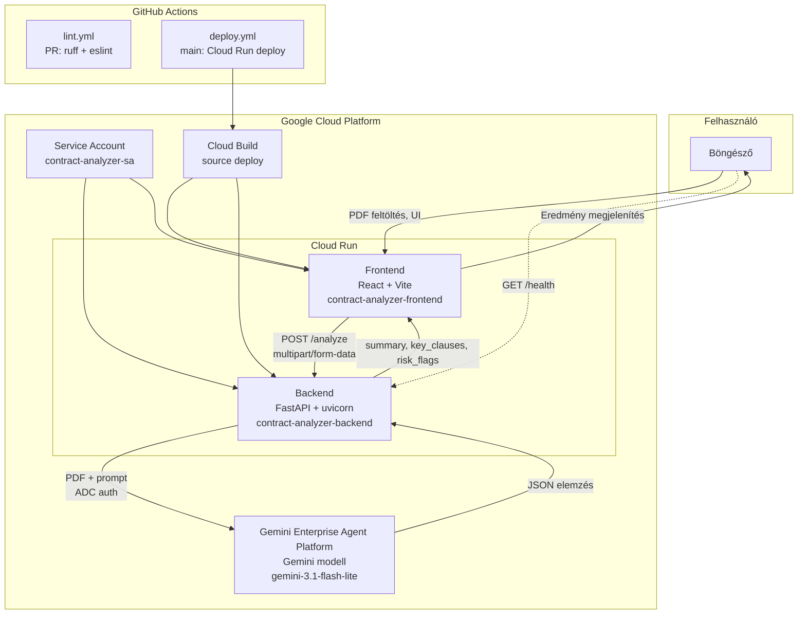

# Szerződéselemző rendszer

PDF szerződések elemzése a Gemini API (Gemini Enterprise Agent Platform) segítségével. A rendszer strukturált magyar nyelvű eredményt ad vissza: összefoglaló, kulcs klauzulák és kockázatos részek.

> **Megjegyzés:** A korábbi **Vertex AI** platformot Google a **Gemini Enterprise Agent Platform** néven egyesítette (Google Cloud Next ’26). A technikai API-k (`aiplatform.googleapis.com`) és IAM szerepkörök (`roles/aiplatform.user`) továbbra is ezt a nevet használják.

## Architektúra



## Architektúra komponensek

| Komponens | Technológia | Felelősség |
|-----------|-------------|------------|
| **Frontend** | React, Vite, `serve` | PDF feltöltés (drag-and-drop), elemzés indítása, eredmények megjelenítése magyar UI-val |
| **Backend** | FastAPI, uvicorn, `google-genai` | PDF fogadása, Gemini hívás natív PDF inputtal, JSON válasz validálása |
| **Gemini Enterprise Agent Platform** | `gemini-3.1-flash-lite` | Szerződés elemzése: összefoglaló, klauzulák, kockázati jelzések (korábban Vertex AI) |
| **Cloud Run** | Source deploy (Docker nélkül) | Backend és frontend külön skálázható szolgáltatásként fut |
| **Service Account** | `contract-analyzer-sa` | ADC a backend számára; IAM: `roles/aiplatform.user`, `roles/run.invoker` (platform API neve változatlan) |
| **Cloud Build** | Buildpacks | Forráskódból image építés deploy során |
| **GitHub Actions** | `lint.yml`, `deploy.yml` | PR lint; `main` branch push-ra automatikus GCP deploy |

### API végpontok

| Végpont | Metódus | Leírás |
|---------|---------|--------|
| `/health` | GET | Health check – válasz: `{"status": "rendben"}` |
| `/analyze` | POST | PDF fájl (`multipart/form-data`, mező: `file`) – strukturált JSON elemzés |

### Elemzés válasz struktúra

```json
{
  "summary": "A szerződés rövid összefoglalója (max. 5 mondat, magyarul)",
  "key_clauses": [
    { "title": "Klauzula címe", "description": "Rövid leírás" }
  ],
  "risk_flags": [
    { "quote": "Idézet a szerződésből", "explanation": "Miért kockázatos" }
  ]
}
```

## Előfeltételek

- **Node.js** 20+
- **uv** ([telepítés](https://docs.astral.sh/uv/))
- **gcloud CLI** (GCP deploy-hoz)
- **GCP projekt** Gemini Enterprise Agent Platform API-val (`aiplatform.googleapis.com`) és megfelelő IAM jogosultságokkal

---

## Helyi telepítés és tesztelés

### 1. Backend

```bash
cd backend
cp .env.example .env
```

Állítsd be a `.env` fájlban:

```env
GEMINI_MODEL=gemini-3.1-flash-lite
GCP_PROJECT_ID=<a-gcp-projekt-id>
GCP_REGION=europe-west1
CORS_ORIGINS=*
```

Autentikáció (Application Default Credentials):

```bash
gcloud auth application-default login
gcloud config set project <a-gcp-projekt-id>
```

Függőségek telepítése és indítás:

```bash
uv sync
uv run uvicorn main:app --reload --port 8080
```

**Health check** (GCP konfiguráció nélkül is működik):

```bash
curl http://localhost:8080/health
# {"status":"rendben"}
```

**Elemzés tesztelése** (működő GCP projekt és ADC szükséges):

```bash
curl -X POST http://localhost:8080/analyze \
  -F "file=@/path/to/szerzodes.pdf;type=application/pdf"
```

Várható hibák helyi környezetben:

| Hiba | Ok |
|------|-----|
| `503 – A GCP_PROJECT_ID környezeti változó kötelező` | `.env` nincs kitöltve |
| `500 – A szerződés elemzése sikertelen` | Nincs ADC, vagy hiányzó Gemini Enterprise Agent Platform jogosultság |
| `502 – A Gemini válasz nem érvényes JSON` | Modell válasz formátum hiba |

### 2. Frontend

```bash
cd frontend
cp .env.example .env
npm install
npm run dev
```

A `.env` fájlban:

```env
VITE_API_URL=http://localhost:8080
```

Nyisd meg: [http://localhost:5173](http://localhost:5173)

Tölts fel egy PDF-et, kattints az **Elemzés indítása** gombra, és ellenőrizd a három eredményszekciót.

### 3. Lint ellenőrzés

```bash
# Backend
cd backend && uv sync --group dev && uv run ruff check .

# Frontend
cd frontend && npm install && npm run lint && npm run build
```

---

## GCP telepítés és tesztelés

### 1. Infrastruktúra felállítása

```bash
export GCP_PROJECT_ID=<a-gcp-projekt-id>
./scripts/setup.sh
```

A script:

1. Engedélyezi a szükséges API-kat (`run`, `aiplatform` – Gemini Enterprise Agent Platform, `cloudbuild`)
2. Létrehozza a `contract-analyzer-sa` service accountot
3. IAM szerepköröket rendel hozzá
4. Cloud Run service-eket hoz létre placeholder image-dzsel
5. Környezeti változókat állít be
6. Kiírja a backend és frontend URL-eket

### 2. GitHub Secrets (automatikus deploy-hoz)

| Secret | Leírás |
|--------|--------|
| `GCP_PROJECT_ID` | GCP projekt azonosító |
| `GCP_SA_KEY` | Service account JSON kulcs (deploy jogosultságokkal) |

A `main` branch push-ra a `deploy.yml` workflow source deploy-tal feltölti a backendet és frontendet Cloud Run-ra.

### 3. Manuális deploy (opcionális)

**Backend:**

```bash
cd backend
gcloud run deploy contract-analyzer-backend \
  --source . \
  --region europe-west1 \
  --allow-unauthenticated \
  --service-account contract-analyzer-sa@${GCP_PROJECT_ID}.iam.gserviceaccount.com \
  --set-env-vars="GEMINI_MODEL=gemini-3.1-flash-lite,GCP_PROJECT_ID=${GCP_PROJECT_ID},GCP_REGION=europe-west1,CORS_ORIGINS=*"
```

**Frontend** (a backend URL-jét build időben kell megadni):

```bash
BACKEND_URL=$(gcloud run services describe contract-analyzer-backend \
  --region europe-west1 --format='value(status.url)')

cd frontend
gcloud run deploy contract-analyzer-frontend \
  --source . \
  --region europe-west1 \
  --allow-unauthenticated \
  --service-account contract-analyzer-sa@${GCP_PROJECT_ID}.iam.gserviceaccount.com \
  --set-build-env-vars="VITE_API_URL=${BACKEND_URL}"
```

### 4. GCP tesztelés

**Backend health:**

```bash
BACKEND_URL=$(gcloud run services describe contract-analyzer-backend \
  --region europe-west1 --format='value(status.url)')

curl "${BACKEND_URL}/health"
```

**Teljes elemzés a felületen:**

```bash
FRONTEND_URL=$(gcloud run services describe contract-analyzer-frontend \
  --region europe-west1 --format='value(status.url)')

echo "Nyisd meg: ${FRONTEND_URL}"
```

Tölts fel egy PDF szerződést, és ellenőrizd, hogy az eredmény magyar nyelven jelenik meg.

**Elemzés curl-lel a Cloud Run backenden:**

```bash
curl -X POST "${BACKEND_URL}/analyze" \
  -F "file=@/path/to/szerzodes.pdf;type=application/pdf"
```

### 5. Erőforrások törlése

```bash
export GCP_PROJECT_ID=<a-gcp-projekt-id>
./scripts/teardown.sh
```

---

## Működik-e?

| Réteg | Állapot | Megjegyzés |
|-------|---------|------------|
| Frontend build + lint | Működik | `npm run build` és `npm run lint` sikeres |
| Backend lint | Működik | `uv run ruff check` sikeres |
| `/health` helyben | Működik | GCP konfiguráció nélkül is elindul |
| `/analyze` | GCP függő | Érvényes `GCP_PROJECT_ID`, ADC és Gemini Enterprise Agent Platform API szükséges |
| GCP deploy | Konfiguráció függő | `setup.sh` + GitHub Secrets + `main` push |

A teljes end-to-end elemzés **csak működő GCP környezetben** fut le: a backend a Gemini Enterprise Agent Platformon futó Gemini modellt hívja ADC-vel, a PDF-et natívan adja át, és magyar nyelvű JSON-t vár vissza.

---

## Projekt struktúra

```
trn-gcp-ai-contract-analyzer/
├── backend/           # FastAPI backend
├── frontend/          # React + Vite UI
├── scripts/           # setup.sh, teardown.sh
├── .github/workflows/ # lint.yml, deploy.yml
└── CLAUDE.md          # Fejlesztési specifikáció
```
