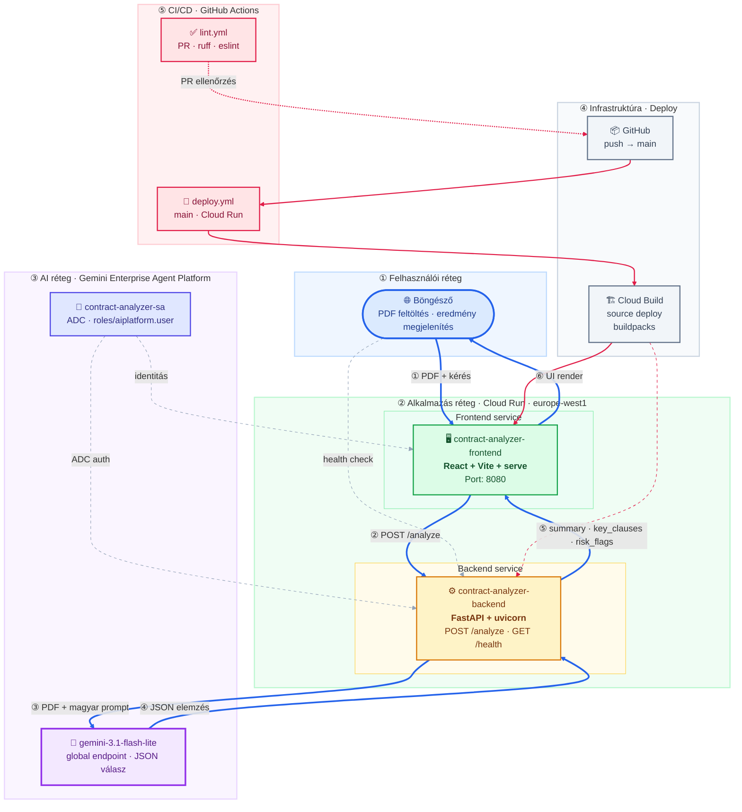
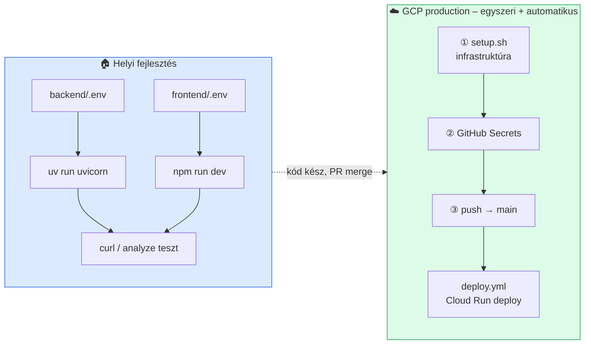

# Szerződéselemző rendszer

PDF szerződések elemzése a Gemini API (Gemini Enterprise Agent Platform) segítségével. A rendszer strukturált magyar nyelvű eredményt ad vissza: összefoglaló, kulcs klauzulák és kockázatos részek.

> **Megjegyzés:** A korábbi **Vertex AI** platformot Google a **Gemini Enterprise Agent Platform** néven egyesítette (Google Cloud Next ’26). A technikai API-k (`aiplatform.googleapis.com`) és IAM szerepkörök (`roles/aiplatform.user`) továbbra is ezt a nevet használják.

## Architektúra



## Architektúra komponensek

Minden komponens egy jól körülhatárolt felelősségi kör – így a backend és frontend egymástól függetlenül deployolható.

| Komponens | Technológia | Felelősség | Miért külön? |
|-----------|-------------|------------|--------------|
| **Frontend** | React, Vite, `serve` | PDF feltöltés, elemzés indítása, eredmények megjelenítése | Csak UI – nem tartalmaz üzleti logikát vagy AI hívást |
| **Backend** | FastAPI, uvicorn, `google-genai` | PDF fogadása, Gemini hívás, JSON validálás | Az AI integráció és adatfeldolgozás egy helyen, biztonságosan |
| **Gemini Enterprise Agent Platform** | `gemini-3.1-flash-lite` | Szerződés elemzése magyar JSON-nal | Managed AI – nem kell saját modellt futtatni |
| **Cloud Run** | Source deploy | Skálázható futtatás HTTPS-sel | Serverless – nincs szerver üzemeltetés |
| **Service Account** | `contract-analyzer-sa` | ADC auth, IAM jogosultságok | Az alkalmazás ne a fejlesztő személyes credjével fusson |
| **Cloud Build** | Buildpacks | Forráskódból image építés deploy-kor | Docker nélküli, egyszerű source deploy |
| **GitHub Actions** | `lint.yml`, `deploy.yml` | Lint PR-en, deploy `main`-en | Reprodukálható CI/CD, nem kézi lépés |

### API végpontok

| Végpont | Metódus | Leírás |
|---------|---------|--------|
| `/health` | GET | Health check – válasz: `{"status": "rendben"}` |
| `/analyze` | POST | PDF fájl (`multipart/form-data`, mező: `file`) – strukturált JSON elemzés |

### Elemzés válasz struktúra

```json
{
  "summary": "A szerződés rövid összefoglalója (max. 5 mondat, magyarul)",
  "key_clauses": [
    { "title": "Klauzula címe", "description": "Rövid leírás" }
  ],
  "risk_flags": [
    { "quote": "Idézet a szerződésből", "explanation": "Miért kockázatos" }
  ]
}
```

## Előfeltételek

| Eszköz | Miért kell? |
|--------|-------------|
| **Node.js** 20+ | Frontend futtatásához és buildhez |
| **uv** ([telepítés](https://docs.astral.sh/uv/)) | Backend függőségek kezelése |
| **gcloud CLI** | GCP infrastruktúra (`setup.sh`) és helyi ADC auth |
| **GCP projekt** | Gemini Enterprise Agent Platform API (`aiplatform.googleapis.com`) + IAM |

---

## Telepítési áttekintés

A projektnek **két külön célja** van – ne keverd össze őket:

| Környezet | Cél | Hogyan telepítünk? |
|-----------|-----|---------------------|
| **Helyi (fejlesztői gép)** | Gyors fejlesztés, hibakeresés, API teszt curl-lel | Kézzel: `uv` + `npm run dev` |
| **GCP (production)** | Valódi felhasználók, Cloud Run | Automatikusan: **GitHub Actions** (`deploy.yml`) |



### Ki mit csinál?

| Lépés | Eszköz | Mit telepít? | Gyakoriság |
|-------|--------|--------------|------------|
| Infrastruktúra (API-k, SA, üres Cloud Run service) | `scripts/setup.sh` | GCP erőforrások – **nem** az alkalmazás kódját | Egyszer, projekt elején |
| Alkalmazás kód (backend + frontend) | **GitHub Actions** `deploy.yml` | Forráskód → Cloud Run (source deploy) | Minden `main` push |
| Lint ellenőrzés | GitHub Actions `lint.yml` | Kódminőség PR-en | Minden pull request |
| Manuális `gcloud run deploy` | *(lásd lent)* | Ugyanaz, amit a CI is csinál | **Csak kivételes esetben** |

> **Fontos:** A Cloud Run-ra való telepítés **alapértelmezetten a GitHub Actions-szel történik**. A `setup.sh` csak az infrastruktúrát készíti elő; magát az alkalmazást a `main` branch-re pusholt kód deployolja a CI.

---

## Helyi telepítés és tesztelés

### Miért csináljuk?

- **Gyorsabb iteráció** – nincs Cloud Build várakozás, azonnali reload.
- **Olcsóbb** – fejlesztés közben nem fut Cloud Run és Gemini hívás csak tesztkor történik.
- **Könnyebb hibakeresés** – logok a terminálban, breakpoint a kódban.
- **CI előtti ellenőrzés** – amit helyben lefuttatsz, azt a PR-en is lefuttatja a `lint.yml`.

### Miért a backenddel kezdünk?

1. A **frontend a backend API-ra épül** – a `VITE_API_URL` a backend címére mutat.
2. A **üzleti logika és a Gemini hívás** a backendben van – curl-lel önállóan is tesztelhető.
3. Ha a backend `/analyze` működik, a frontend már csak megjelenít – kevesebb változó.

### 1. Backend

```bash
cd backend
cp .env.example .env
```

**Miért?** A backend környezeti változókból olvassa a GCP projektet, modellt és CORS beállítást – helyben is ugyanazt a Gemini API-t hívja, mint Cloud Run-on.

Állítsd be a `.env` fájlban:

```env
GEMINI_MODEL=gemini-3.1-flash-lite
GCP_PROJECT_ID=<a-gcp-projekt-id>
GEMINI_LOCATION=global
CORS_ORIGINS=*
```

> **Miért `GEMINI_LOCATION=global`?** A `gemini-3.1-flash-lite` modell csak a **global** Vertex/Gemini endpointon érhető el – nem regionalis (pl. `europe-west1`) location-nel. A Cloud Run továbbra is `europe-west1`-en fut; ez külön beállítás a deploy scriptekben (`GCP_REGION`).

**Miért kell az ADC?** A backend nem API kulcsot használ, hanem Application Default Credentials-t – ugyanazt az auth módot, mint Cloud Run-on a service account.

```bash
gcloud auth application-default login
gcloud config set project <a-gcp-projekt-id>
```

```bash
uv sync
./dev.sh
```

> **Fontos:** Ne a globális `uvicorn` parancsot használd – `ModuleNotFoundError: No module named 'google'` hibát kapsz. A függőségek a projekt `.venv`-jében vannak. Használd: `./dev.sh` vagy `uv run python -m uvicorn main:app --reload --port 8080`.

**Health check** – ellenőrzi, hogy a szerver elindult-e (GCP nélkül is):

```bash
curl http://localhost:8080/health
# {"status":"rendben"}
```

**Elemzés teszt** – ellenőrzi a teljes Gemini integrációt (GCP projekt + ADC kell):

```bash
curl -X POST http://localhost:8080/analyze \
  -F "file=@/path/to/szerzodes.pdf;type=application/pdf"
```

| Hiba | Ok |
|------|-----|
| `503 – A GCP_PROJECT_ID környezeti változó kötelező` | `.env` nincs kitöltve |
| `500 – A szerződés elemzése sikertelen` | Nincs ADC, vagy hiányzó Gemini Enterprise Agent Platform jogosultság |
| `502 – A Gemini válasz nem érvényes JSON` | Modell válasz formátum hiba |
| `ModuleNotFoundError: No module named 'google'` | Globális Python/uvicorn fut – használd: `uv sync` majd `./dev.sh` |

### 2. Frontend

**Miért második?** A frontend csak HTTP kéréseket küld – futnia kell a backendnek, és a `VITE_API_URL`-nek arra kell mutatnia.

```bash
cd frontend
cp .env.example .env
npm install
npm run dev
```

```env
VITE_API_URL=http://localhost:8080
```

**Miért build időben kell a URL?** A Vite a `VITE_*` változókat a build során beégeti a bundle-be – helyben a dev szerver, Cloud Run-on a CI adja meg deploy-kor.

Nyisd meg: [http://localhost:5173](http://localhost:5173) – tölts fel PDF-et, indítsd az elemzést, ellenőrizd a három eredményszekciót.

### 3. Lint ellenőrzés

**Miért?** Ugyanazokat a szabályokat futtatja, mint a CI – így a PR nem bukik meg meglepetés lint hibán.

```bash
cd backend && uv sync --group dev && uv run ruff check .
cd frontend && npm install && npm run lint && npm run build
```

---

## GCP telepítés és tesztelés

### Miért csináljuk?

- A helyi gép **nem production környezet** – skálázás, HTTPS, stabil URL csak Cloud Run-on van.
- A **GitHub Actions** biztosítja, hogy minden `main`-re kerülő kód automatikusan, reprodukálható módon deployolódjon.

### Telepítési sorrend (ajánlott)

```
① setup.sh          →  GCP infrastruktúra (egyszer)
② GitHub Secrets    →  CI hitelesítés
③ git push main     →  alkalmazás deploy (automatikus, deploy.yml)
④ tesztelés         →  Cloud Run URL-eken
```

---

### ① Infrastruktúra – `setup.sh` (egyszer)

**Miért külön script?** A GitHub Actions **nem** hoz létre service accountot vagy engedélyez API-kat – csak a meglévő Cloud Run service-ekre deployol. Az infrastruktúrát egyszer, kézzel kell felállítani.

```bash
export GCP_PROJECT_ID=<a-gcp-projekt-id>
./scripts/setup.sh
```

A script:

1. Engedélyezi a szükséges API-kat (`run`, `aiplatform`, `cloudbuild`)
2. Létrehozza a `contract-analyzer-sa` service accountot
3. IAM szerepköröket rendel hozzá (`aiplatform.user`, `run.invoker`)
4. Cloud Run service-eket hoz létre placeholder image-dzsel
5. Alap környezeti változókat állít be
6. Kiírja a backend és frontend URL-eket

> A placeholder image **nem** a valódi alkalmazás – az első sikeres `deploy.yml` futás cseréli le a tényleges kódra.

---

### ② GitHub Secrets (CI deploy-hoz)

**Miért?** A `deploy.yml` workflow-nak GCP hozzáférés kell a Cloud Run deploy-hoz – ezt Secrets-ből kapja, nem a repóból.

| Secret | Miért kell? |
|--------|-------------|
| `GCP_PROJECT_ID` | Melyik GCP projektbe deployoljon |
| `GCP_SA_KEY` | Service account JSON kulcs Cloud Run és Cloud Build jogosultságokkal |

A Secrets beállítása után **minden `main` push automatikusan deployol**:

1. `deploy.yml` → backend source deploy Cloud Run-ra
2. `deploy.yml` → frontend source deploy (a backend URL-jével build időben)

**Nincs szükség kézi `gcloud run deploy`-ra a normál munkafolyamatban.**

---

### ③ Alkalmazás deploy – GitHub Actions (automatikus)

**Miért így?** Reprodukálható, verziózott, auditálható deploy – minden release a git history-hoz kötött, nem egy fejlesztő gépén futó parancs.

```bash
git push origin main
```

A `deploy.yml` a `.github/workflows/` mappából:

- Backend: `gcloud run deploy contract-analyzer-backend --source ./backend`
- Frontend: `gcloud run deploy contract-analyzer-frontend --source ./frontend` + `VITE_API_URL` build env

Ellenőrzés: GitHub → **Actions** fül → legutóbbi workflow futás.

---

### ④ GCP tesztelés

**Miért?** Deploy után ellenőrizni kell, hogy a Cloud Run környezet (service account, env vars, hálózat) is működik – a helyi siker még nem garantálja.

**Backend health:**

```bash
BACKEND_URL=$(gcloud run services describe contract-analyzer-backend \
  --region europe-west1 --format='value(status.url)')

curl "${BACKEND_URL}/health"
```

**Teljes elemzés a felületen:**

```bash
FRONTEND_URL=$(gcloud run services describe contract-analyzer-frontend \
  --region europe-west1 --format='value(status.url)')

echo "Nyisd meg: ${FRONTEND_URL}"
```

**Elemzés curl-lel:**

```bash
curl -X POST "${BACKEND_URL}/analyze" \
  -F "file=@/path/to/szerzodes.pdf;type=application/pdf"
```

---

### ⑤ Erőforrások törlése – `teardown.sh`

**Miért?** Fejlesztés vagy demo után ne maradjanak felesleges Cloud Run service-ek és IAM kötések – költség és biztonság.

```bash
export GCP_PROJECT_ID=<a-gcp-projekt-id>
./scripts/teardown.sh
```

---

### Manuális deploy – csak kivételes esetben

**Miért van egyáltalán?** A `gcloud run deploy` parancs **ugyanazt csinálja**, amit a `deploy.yml` – manuálisan csak akkor futtasd, ha:

- a GitHub Actions **nem elérhető** (pl. Actions leállás, secret hiba debug)
- **első deploy előtt** teszteled a gcloud parancsot
- **hotfix** kell, de még nem merge-elted a `main`-t

Normál munkafolyamatban **ne használd** – a CI a single source of truth.

<details>
<summary>Kézi deploy parancsok (fallback)</summary>

```bash
export GCP_PROJECT_ID=<a-gcp-projekt-id>

# Backend
cd backend
gcloud run deploy contract-analyzer-backend \
  --source . \
  --region europe-west1 \
  --allow-unauthenticated \
  --service-account contract-analyzer-sa@${GCP_PROJECT_ID}.iam.gserviceaccount.com \
  --set-env-vars="GEMINI_MODEL=gemini-3.1-flash-lite,GCP_PROJECT_ID=${GCP_PROJECT_ID},GEMINI_LOCATION=global,CORS_ORIGINS=*"

# Frontend
BACKEND_URL=$(gcloud run services describe contract-analyzer-backend \
  --region europe-west1 --format='value(status.url)')

cd ../frontend
gcloud run deploy contract-analyzer-frontend \
  --source . \
  --region europe-west1 \
  --allow-unauthenticated \
  --service-account contract-analyzer-sa@${GCP_PROJECT_ID}.iam.gserviceaccount.com \
  --set-build-env-vars="VITE_API_URL=${BACKEND_URL}"
```

</details>

---

## Működik-e?

| Réteg | Állapot | Miért / megjegyzés |
|-------|---------|---------------------|
| Frontend build + lint | ✅ | Független a GCP-től – csak Node.js kell |
| Backend lint | ✅ | Független a GCP-től – csak uv kell |
| `/health` helyben | ✅ | Nem hív Gemini-t, csak az API elérhetőségét jelzi |
| `/analyze` helyben | ⚠️ GCP kell | Gemini hívás ADC-vel – ugyanaz, mint Cloud Run-on |
| GCP infrastruktúra | ⚠️ Egyszer kézzel | `setup.sh` – a CI ezt nem csinálja meg helyetted |
| GCP alkalmazás deploy | ⚠️ CI-vel | `git push main` → `deploy.yml` – **ez az alapértelmezett út** |

A teljes end-to-end elemzés **működő GCP környezetben** fut le: a backend a Gemini Enterprise Agent Platformon hívja a modellt ADC-vel, a PDF-et natívan adja át, és magyar nyelvű JSON-t vár vissza.

---

## Projekt struktúra

```
trn-gcp-ai-contract-analyzer/
├── backend/           # FastAPI backend
├── frontend/          # React + Vite UI
├── scripts/           # setup.sh, teardown.sh
├── .github/workflows/ # lint.yml, deploy.yml
└── CLAUDE.md          # Fejlesztési specifikáció
```
