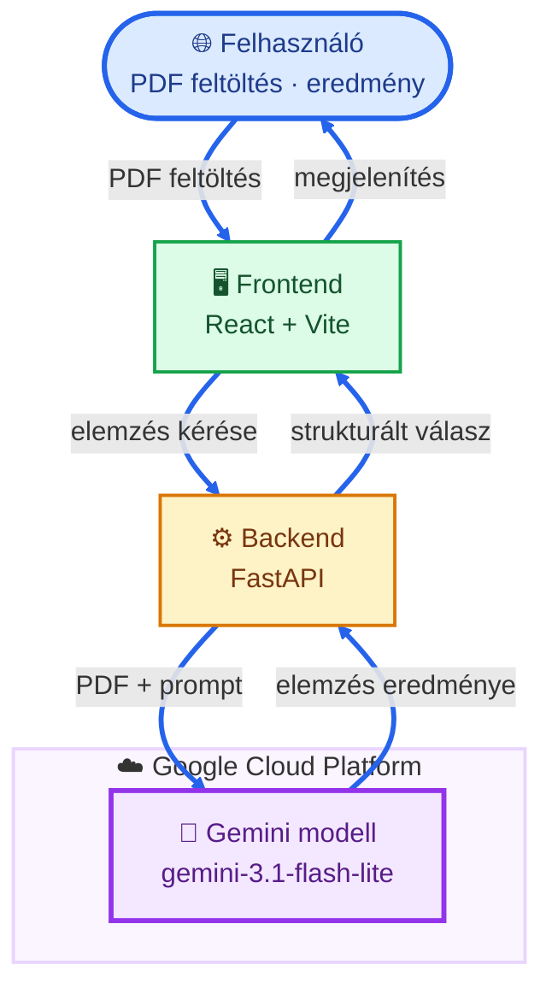
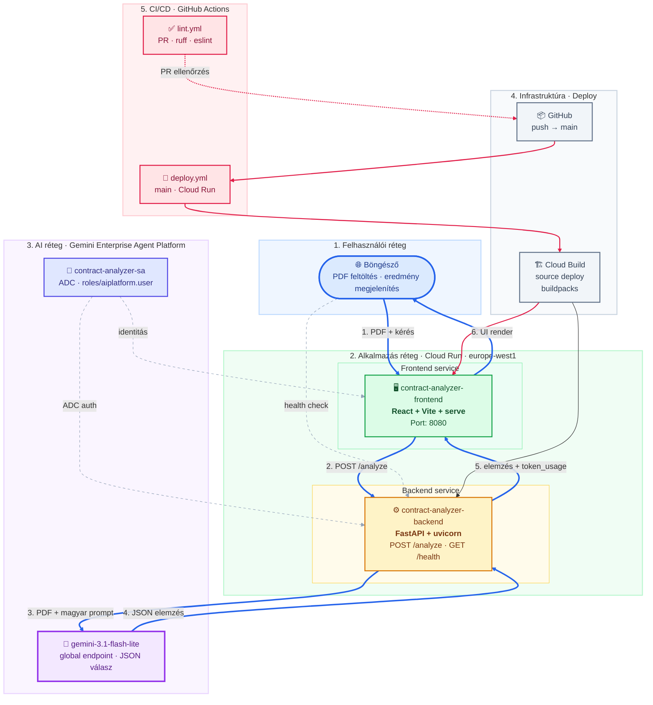
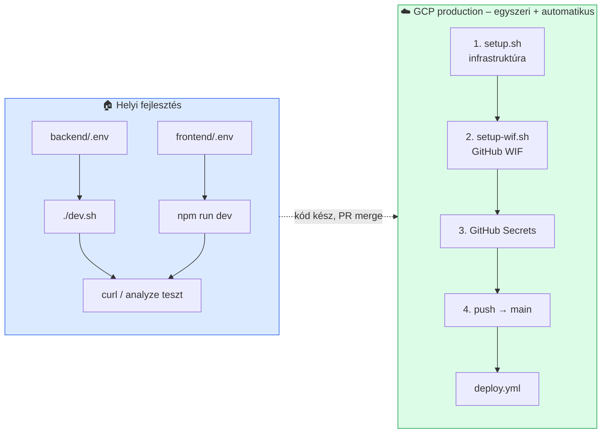

# Szerződéselemző rendszer

PDF szerződések elemzése a Gemini API (Gemini Enterprise Agent Platform) segítségével. A rendszer strukturált magyar nyelvű eredményt ad vissza: megfelelőségi skála, összefoglaló, kulcs klauzulák, kockázatos részek és token felhasználás.

> **Megjegyzés:** A korábbi **Vertex AI** platformot Google a **Gemini Enterprise Agent Platform** néven egyesítette (Google Cloud Next ’26). A technikai API-k (`aiplatform.googleapis.com`) és IAM szerepkörök (`roles/aiplatform.user`) továbbra is ezt a nevet használják.

## Tartalom

1. [Általános ismerető](#1-általános-ismerető) *(ez a szekció)*
2. [Szerződés elemzés Gemini-vel](#2-szerződés-elemzés-gemini-vel)
3. [Szerződés elemzés Gemini AI Studioval](#3-szerződés-elemzés-gemini-ai-studioval)
4. [Szerződés elemzés skálázható felhő alapú megoldással](#4-szerződés-elemzés-skálázható-felhő-alapú-megoldással)

---

## 1. Általános ismerető

Ez a projekt **három módon** mutatja be ugyanazt a szerződés-elemzési feladatot:

| Módszer | Célcsoport | Infrastruktúra |
|---------|------------|----------------|
| **Gemini** (csatolt PDF) | Gyors kipróbálás, egyedi dokumentumok | Nincs – Gemini felület + prompt |
| **Gemini AI Studio** | Fejlesztők, prompt finomhangolás | Nincs – AI Studio + prompt |
| **Felhő alapú alkalmazás** | Csapatok, production, skálázás | GCP Cloud Run + GitHub Actions |

Mindhárom módszer **ugyanazt a prompt logikát** követi: összefoglaló, kulcs klauzulák, kockázatok és szerződés minősítése magyar nyelven.

---

## 2. Szerződés elemzés Gemini-vel

A Gemini chat felületén (pl. [gemini.google.com](https://gemini.google.com)) közvetlenül is elvégezhető a szerződés-elemzés – **nem kell kódot írni**.

### Előfeltételek

- Google-fiók Gemini hozzáféréssel
- A szerződés **PDF formátumban** – akár a **Google Drive**-ról csatolva vagy megnyitva

### Lépések

1. Nyisd meg a Gemini felületet.
2. Csatold a szerződés PDF-et (feltöltés vagy Google Drive-ból).
3. Másold be az alábbi promptot, és küldd el.
4. Ellenőrizd a választ: összefoglaló, klauzulák, kockázatok, minősítés.

### Elemzési prompt

```
Feladat: Szerződés elemzése

Kérlek, olvasd el a csatolt szerződést, és készíts róla egy összefoglaló jelentést az alábbi szempontok szerint:

Összefoglaló (summary): Írj egy rövid, legfeljebb 5 mondatos áttekintést a szerződés lényegéről.

Főbb pontok (key_clauses): Szedd össze a szerződés legfontosabb szakaszait. Minden pontnál add meg a szakasz címét és egy rövid leírást arról, mit tartalmaz.

Kockázatok (risk_flags): Emeld ki a potenciálisan problémás részeket. Minden ilyen esetnél másold be az eredeti idézetet a szerződésből, és írd le magyarul, miért tartod kockázatosnak.

Szerződés minősítése (contract_quality): Értékeld a dokumentumot az alábbi szempontok alapján:

Pontszám (score): Adj rá egy osztályzatot 1-től 10-ig (ahol 10 a teljesen korrekt és átlátható, 1 pedig a súlyosan hiányos vagy veszélyes).

Szint (level): Sorold be egy színkategóriába: „green” (zöld, 7-10 pont), „yellow” (sárga, 4-6 pont) vagy „red” (piros, 1-3 pont).

Minősítés (label): Adj egy rövid magyar értékelést (pl. „Korrekt”, „Figyelmet igényel” vagy „Kockázatos”).

Indoklás (explanation): Egy-két mondatban magyarázd meg, miért ezt az értékelést adtad.

Technikai kérés: A magyarázatok és összefoglalók legyenek magyar nyelvűek, de az idézeteknél tartsd meg az eredeti, szerződésben szereplő szöveget.
```

### Korlátok

- Manuális folyamat – nincs automatizált API vagy csapatos workflow.
- A válasz formátuma szabad szöveg (nem garantált JSON).
- Érzékeny szerződéseknél figyelj az adatkezelési szabályokra.

---

## 3. Szerződés elemzés Gemini AI Studioval

A [Google AI Studio](https://aistudio.google.com) fejlesztői felületen ugyanaz az elemzés kipróbálható, prompt finomhangolással és modellválasztással.

### Előfeltételek

- Google-fiók AI Studio hozzáféréssel
- Szerződés PDF – feltöltve, vagy elérhető a **Google Drive**-on (AI Studio-ból csatolható)

### Lépések

1. Nyisd meg: [https://aistudio.google.com](https://aistudio.google.com)
2. Hozz létre egy **Playground** / **Chat** promptot.
3. Válassz modellt (pl. `gemini-3.1-flash-lite` vagy elérhető Gemini 3 verzió).
4. Csatold a PDF szerződést (Upload file, vagy Drive integráció ha elérhető).
5. Illeszd be a [2. szekció promptját](#elemzési-prompt).
6. Futtasd, és értékeld a választ.

### Mire jó ez a módszer?

- **Prompt iteráció** – gyorsan kísérletezhetsz a szöveg finomításával.
- **Modell összehasonlítás** – különböző Gemini verziók tesztelése.
- **Prototípus** – a felhő alkalmazás promptja innen származtatható.

### Korlátok

- Nem skálázható production forgalomra.
- Nincs saját UI, auth, deploy pipeline – ehhez a [4. szekció](#4-szerződés-elemzés-skálázható-felhő-alapú-megoldással) szükséges.

---

## 4. Szerződés elemzés skálázható felhő alapú megoldással

Ez a repository **production-ready** megoldást ad: React frontend, FastAPI backend, Gemini Enterprise Agent Platform API, Cloud Run deploy és GitHub Actions CI/CD.

A backend **ugyanazt az elemzési logikát** implementálja, mint a fenti prompt – strukturált JSON választ ad vissza, amit a frontend megjelenít.

### Architektúra

#### Magas szintű áttekintés



#### Részletes architektúra



### Architektúra komponensek

| Komponens | Technológia | Felelősség | Miért külön? |
|-----------|-------------|------------|--------------|
| **Frontend** | React, Vite, `serve` | PDF feltöltés, elemzés, megfelelőségi skála, eredmények, token statisztika | Csak UI – nem tartalmaz üzleti logikát vagy AI hívást |
| **Backend** | FastAPI, uvicorn, `google-genai` | PDF fogadása, Gemini hívás, JSON validálás | Az AI integráció és adatfeldolgozás egy helyen, biztonságosan |
| **Gemini Enterprise Agent Platform** | `gemini-3.1-flash-lite` | Szerződés elemzése magyar JSON-nal | Managed AI – nem kell saját modellt futtatni |
| **Cloud Run** | Source deploy | Skálázható futtatás HTTPS-sel | Serverless – nincs szerver üzemeltetés |
| **Service Account** | `contract-analyzer-sa` | ADC auth, IAM jogosultságok | Az alkalmazás ne a fejlesztő személyes credjével fusson |
| **Cloud Build** | Buildpacks | Forráskódból image építés deploy-kor | Docker nélküli, egyszerű source deploy |
| **GitHub Actions** | `lint.yml`, `deploy.yml` | Lint PR-en, deploy `main`-en | Reprodukálható CI/CD, nem kézi lépés |

### API végpontok

| Végpont | Metódus | Leírás |
|---------|---------|--------|
| `/health` | GET | Health check – válasz: `{"status": "rendben"}` |
| `/analyze` | POST | PDF fájl (`multipart/form-data`, mező: `file`) – strukturált JSON elemzés |

### Elemzés válasz struktúra

```json
{
  "contract_quality": {
    "score": 7,
    "level": "green",
    "label": "Korrekt",
    "explanation": "Rövid indoklás magyarul."
  },
  "summary": "A szerződés rövid összefoglalója (max. 5 mondat, magyarul)",
  "key_clauses": [
    { "title": "Klauzula címe", "description": "Rövid leírás" }
  ],
  "risk_flags": [
    { "quote": "Idézet a szerződésből", "explanation": "Miért kockázatos" }
  ],
  "token_usage": {
    "prompt_tokens": 1234,
    "response_tokens": 567,
    "total_tokens": 1801,
    "cached_tokens": null,
    "thoughts_tokens": null
  }
}
```

| Mező | Forrás | Leírás |
|------|--------|--------|
| `contract_quality` | Gemini | 1–10 skála, zöld/sárga/piros szint, magyar címke és indoklás |
| `summary`, `key_clauses`, `risk_flags` | Gemini | Elemzés magyar szöveggel |
| `token_usage` | API metaadat | Bemenet/kimenet token számok (a backend számolja) |

### Előfeltételek

| Eszköz | Miért kell? |
|--------|-------------|
| **Node.js** 20+ | Frontend futtatásához és buildhez |
| **uv** ([telepítés](https://docs.astral.sh/uv/)) | Backend függőségek kezelése |
| **gcloud CLI** | GCP infrastruktúra (`setup.sh`) és helyi ADC auth |
| **GCP projekt** | Gemini Enterprise Agent Platform API (`aiplatform.googleapis.com`) + IAM |

### Telepítési áttekintés

| Környezet | Cél | Hogyan telepítünk? |
|-----------|-----|---------------------|
| **Helyi (fejlesztői gép)** | Gyors fejlesztés, hibakeresés, API teszt curl-lel | Kézzel: `uv` + `npm run dev` |
| **GCP (production)** | Valódi felhasználók, Cloud Run | Automatikusan: **GitHub Actions** (`deploy.yml`) |



#### Ki mit csinál?

| Lépés | Eszköz | Mit telepít? | Gyakoriság |
|-------|--------|--------------|------------|
| Infrastruktúra (API-k, SA, üres Cloud Run service) | `scripts/setup.sh` | GCP erőforrások – **nem** az alkalmazás kódját | Egyszer, projekt elején |
| GitHub Actions WIF (pool, provider, CI/CD SA) | `scripts/setup-wif.sh` | Kulcs nélküli CI hitelesítés | Egyszer, `setup.sh` után |
| Alkalmazás kód (backend + frontend) | **GitHub Actions** `deploy.yml` | Forráskód → Cloud Run (source deploy) | Minden `main` push |
| Lint ellenőrzés | GitHub Actions `lint.yml` | Kódminőség PR-en | Minden pull request |
| Manuális `gcloud run deploy` | *(lásd lent)* | Ugyanaz, amit a CI is csinál | **Csak kivételes esetben** |

> **Fontos:** A Cloud Run-ra való telepítés **alapértelmezetten a GitHub Actions-szel történik**. A `setup.sh` csak az infrastruktúrát készíti elő.

### Helyi telepítés és tesztelés

#### Miért csináljuk?

- **Gyorsabb iteráció** – nincs Cloud Build várakozás, azonnali reload.
- **Olcsóbb** – fejlesztés közben nem fut Cloud Run.
- **Könnyebb hibakeresés** – logok a terminálban.
- **CI előtti ellenőrzés** – amit helyben lefuttatsz, azt a PR-en is lefuttatja a `lint.yml`.

#### Miért a backenddel kezdünk?

1. A **frontend a backend API-ra épül** – a `VITE_API_URL` a backend címére mutat.
2. A **üzleti logika és a Gemini hívás** a backendben van – curl-lel önállóan is tesztelhető.
3. Ha a backend `/analyze` működik, a frontend már csak megjelenít.

#### 1. Backend

```bash
cd backend
cp .env.example .env
```

Állítsd be a `.env` fájlban:

```env
GEMINI_MODEL=gemini-3.1-flash-lite
GCP_PROJECT_ID=<a-gcp-projekt-id>
GEMINI_LOCATION=global
CORS_ORIGINS=*
```

> **Miért `GEMINI_LOCATION=global`?** A `gemini-3.1-flash-lite` modell csak a **global** endpointon érhető el. A Cloud Run továbbra is `europe-west1`-en fut.

```bash
gcloud auth application-default login
gcloud config set project <a-gcp-projekt-id>
uv sync
./dev.sh
```

> **Fontos:** Használd a `./dev.sh` scriptet – a globális `uvicorn` `ModuleNotFoundError`-t adhat.

**Health check:**

```bash
curl http://localhost:8080/health
# {"status":"rendben"}
```

**Elemzés teszt:**

```bash
curl -X POST http://localhost:8080/analyze \
  -F "file=@/path/to/szerzodes.pdf;type=application/pdf"
```

| Hiba | Ok |
|------|-----|
| `503 – A GCP_PROJECT_ID környezeti változó kötelező` | `.env` nincs kitöltve |
| `500 – A szerződés elemzése sikertelen` | Nincs ADC, vagy hiányzó IAM jogosultság |
| `502 – A Gemini válasz nem érvényes JSON` | Modell válasz formátum hiba |
| `ModuleNotFoundError: No module named 'google'` | Használd: `uv sync` majd `./dev.sh` |

#### 2. Frontend

```bash
cd frontend
cp .env.example .env
npm install
npm run dev
```

```env
VITE_API_URL=http://localhost:8080
```

Nyisd meg: [http://localhost:5173](http://localhost:5173)

#### 3. Lint ellenőrzés

```bash
cd backend && uv sync --group dev && uv run ruff check .
cd frontend && npm install && npm run lint && npm run build
```

### GCP telepítés és tesztelés

#### Telepítési sorrend (ajánlott)

```
1. setup.sh          →  GCP infrastruktúra (egyszer)
2. setup-wif.sh      →  GitHub Actions WIF (egyszer, JSON kulcs nélkül)
3. GitHub Secrets    →  WIF provider + service account azonosítók
4. git push main     →  alkalmazás deploy (automatikus, deploy.yml)
5. tesztelés         →  Cloud Run URL-eken
```

#### 1. Infrastruktúra – `setup.sh`

```bash
export GCP_PROJECT_ID=<a-gcp-projekt-id>
./scripts/setup.sh
```

#### 2. GitHub Actions hitelesítés – WIF (JSON kulcs nélkül)

```bash
export GCP_PROJECT_ID=<a-gcp-projekt-id>
export GITHUB_REPO=<szervezet>/<repo-nev>
./scripts/setup-wif.sh
```

**GitHub Secrets** (Settings → Secrets and variables → Actions):

| Secret | Leírás |
|--------|--------|
| `GCP_PROJECT_ID` | GCP projekt azonosító |
| `GCP_WIF_PROVIDER` | WIF provider teljes resource neve |
| `GCP_WIF_SERVICE_ACCOUNT` | `contract-analyzer-cicd-sa@...` e-mail |

| Service account | Szerep |
|-----------------|--------|
| `contract-analyzer-sa` | App futtatás, Gemini hívás |
| `contract-analyzer-cicd-sa` | Deploy GitHub Actions-ből (WIF) |

**Deploy hiba (`PERMISSION_DENIED`):** futtasd újra a `./scripts/setup-wif.sh`-t.

#### 3. Alkalmazás deploy – GitHub Actions

```bash
git push origin main
```

Ellenőrzés: GitHub → **Actions** fül.

#### 4. GCP tesztelés

```bash
BACKEND_URL=$(gcloud run services describe contract-analyzer-backend \
  --region europe-west1 --format='value(status.url)')
curl "${BACKEND_URL}/health"

FRONTEND_URL=$(gcloud run services describe contract-analyzer-frontend \
  --region europe-west1 --format='value(status.url)')
echo "Nyisd meg: ${FRONTEND_URL}"
```

#### 5. Erőforrások törlése

```bash
export GCP_PROJECT_ID=<a-gcp-projekt-id>
export GITHUB_REPO=<szervezet>/<repo-nev>
./scripts/teardown.sh
./scripts/teardown-wif.sh
```

<details>
<summary>Manuális deploy (fallback)</summary>

```bash
export GCP_PROJECT_ID=<a-gcp-projekt-id>
CICD_SA=contract-analyzer-cicd-sa@${GCP_PROJECT_ID}.iam.gserviceaccount.com
RUNTIME_SA=contract-analyzer-sa@${GCP_PROJECT_ID}.iam.gserviceaccount.com

cd backend
gcloud run deploy contract-analyzer-backend \
  --source . --region europe-west1 --allow-unauthenticated --quiet \
  --service-account "${RUNTIME_SA}" \
  --build-service-account "projects/${GCP_PROJECT_ID}/serviceAccounts/${CICD_SA}" \
  --set-env-vars="GEMINI_MODEL=gemini-3.1-flash-lite,GCP_PROJECT_ID=${GCP_PROJECT_ID},GEMINI_LOCATION=global,CORS_ORIGINS=*"

BACKEND_URL=$(gcloud run services describe contract-analyzer-backend \
  --region europe-west1 --format='value(status.url)')

cd ../frontend
gcloud run deploy contract-analyzer-frontend \
  --source . --region europe-west1 --allow-unauthenticated --quiet \
  --service-account "${RUNTIME_SA}" \
  --build-service-account "projects/${GCP_PROJECT_ID}/serviceAccounts/${CICD_SA}" \
  --set-build-env-vars="VITE_API_URL=${BACKEND_URL}"
```

</details>

### Működik-e?

| Réteg | Állapot | Megjegyzés |
|-------|---------|------------|
| Frontend build + lint | ✅ | Független a GCP-től |
| Backend lint | ✅ | Független a GCP-től |
| `/health` helyben | ✅ | GCP konfiguráció nélkül is |
| `/analyze` helyben | ⚠️ GCP kell | ADC + Gemini API |
| GCP deploy | ⚠️ CI-vel | `setup.sh` + `setup-wif.sh` + `git push main` |

### Projekt struktúra

```
trn-gcp-ai-contract-analyzer/
├── backend/           # FastAPI backend (main.py, dev.sh, pyproject.toml)
├── frontend/          # React + Vite UI
├── scripts/           # setup.sh, setup-wif.sh, teardown.sh, teardown-wif.sh
├── .github/workflows/ # lint.yml, deploy.yml
└── CLAUDE.md          # Fejlesztési specifikáció
```
